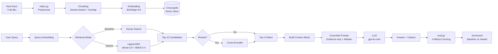

# Architecture — RAG Pipeline (Day 08 Lab)

> Template: Điền vào các mục này khi hoàn thành từng sprint.
> Deliverable của Documentation Owner.

## 1. Tổng quan kiến trúc

```
[Raw Docs]
    ↓
[index.py: Preprocess → Chunk → Embed → Store]
    ↓
[ChromaDB Vector Store]
    ↓
[rag_answer.py: Query → Retrieve → Rerank → Generate]
    ↓
[Grounded Answer + Citation]
```

**Mô tả ngắn gọn:**
> Nhóm xây dựng trợ lý nội bộ cho khối CS + IT Helpdesk, trả lời câu hỏi về chính sách hoàn tiền, SLA ticket, quy trình cấp quyền và FAQ. Hệ thống retrieve evidence từ 5 tài liệu policy và generate câu trả lời có citation, đảm bảo không hallucinate.

---

## 2. Indexing Pipeline (Sprint 1)

### Tài liệu được index
| File | Nguồn | Department | Số chunk |
|------|-------|-----------|---------|
| `policy_refund_v4.txt` | policy/refund-v4.pdf | CS | TODO |
| `sla_p1_2026.txt` | support/sla-p1-2026.pdf | IT | TODO |
| `access_control_sop.txt` | it/access-control-sop.md | IT Security | TODO |
| `it_helpdesk_faq.txt` | support/helpdesk-faq.md | IT | TODO |
| `hr_leave_policy.txt` | hr/leave-policy-2026.pdf | HR | TODO |

### Quyết định chunking
| Tham số | Giá trị | Lý do |
|---------|---------|-------|
| Chunk size | 400 tokens (~1600 ký tự) | Balance giữa ngữ cảnh đủ cho LLM và độ chính xác embedding |
| Overlap | 80 tokens (~320 ký tự) | Đảm bảo thông tin không bị cắt giữa câu, giữ continuity giữa các chunk |
| Chunking strategy | Heading-based (split theo `=== Section ===`) | Tài liệu có cấu trúc heading rõ ràng, cắt theo ranh giới tự nhiên thay vì token cứng |
| Metadata fields | source, section, effective_date, department, access | Phục vụ filter, freshness, citation |

### Embedding model
- **Model**: `BAAI/bge-m3` (Sentence Transformers) — chạy local, không cần API key, multilingual
- **Vector store**: ChromaDB (PersistentClient, path: `lab/chroma_db/`)
- **Similarity metric**: Cosine (collection: `rag_lab`, `hnsw:space: cosine`)

---

## 3. Retrieval Pipeline (Sprint 2 + 3)

### Baseline (Sprint 2)
| Tham số | Giá trị |
|---------|---------|
| Strategy | Dense (embedding similarity) |
| Top-k search | 10 |
| Top-k select | 3 |
| Rerank | Không |

### Variant (Sprint 3)
| Tham số | Giá trị | Thay đổi so với baseline |
|---------|---------|------------------------|
| Strategy | Hybrid (dense + sparse với RRF) | Kết hợp dense + BM25 |
| Top-k search | 10 | Giữ nguyên |
| Top-k select | 3 | Giữ nguyên |
| Rerank | Cross-encoder | Chấm lại relevance sau hybrid search |
| Query transform | Expansion (tạo 3 alternative queries) | Tăng recall bằng cách retrieve từ nhiều cách diễn đạt |

**Lý do chọn variant này:**
> Chọn hybrid retrieval vì corpus có cả câu tự nhiên (policy text) lẫn keyword/mã lỗi chuyên ngành (ví dụ: "SLA ticket P1", "ERR-403-AUTH", "Level 3"). Dense retrieval mạnh về semantic matching nhưng yếu với exact term; BM25 bù lại điểm này. Reciprocal Rank Fusion với weights `dense=0.6, sparse=0.4` ưu tiên semantic nhưng vẫn giữ keyword signal. Thêm query expansion để tăng recall khi user dùng alias hoặc paraphrase.

---

## 4. Generation (Sprint 2)

### Grounded Prompt Template
```
Answer only from the retrieved context below.
If the context is insufficient, say you do not know.
Cite the source field when possible.
Keep your answer short, clear, and factual.

Question: {query}

Context:
[1] {source} | {section} | score={score}
{chunk_text}

[2] ...

Answer:
```

### LLM Configuration
| Tham số | Giá trị |
|---------|---------|
| Model | gpt-4o-mini (OpenAI) |
| Temperature | 0 (để output ổn định cho eval) |
| Max tokens | 512 |

---

## 5. Failure Mode Checklist

> Dùng khi debug — kiểm tra lần lượt: index → retrieval → generation

| Failure Mode | Triệu chứng | Cách kiểm tra |
|-------------|-------------|---------------|
| Index lỗi | Retrieve về docs cũ / sai version | `inspect_metadata_coverage()` trong index.py |
| Chunking tệ | Chunk cắt giữa điều khoản | `list_chunks()` và đọc text preview |
| Retrieval lỗi | Không tìm được expected source | `score_context_recall()` trong eval.py |
| Generation lỗi | Answer không grounded / bịa | `score_faithfulness()` trong eval.py |
| Token overload | Context quá dài → lost in the middle | Kiểm tra độ dài context_block |

---

## 6. Diagram (tùy chọn)

### Pipeline tổng thể



